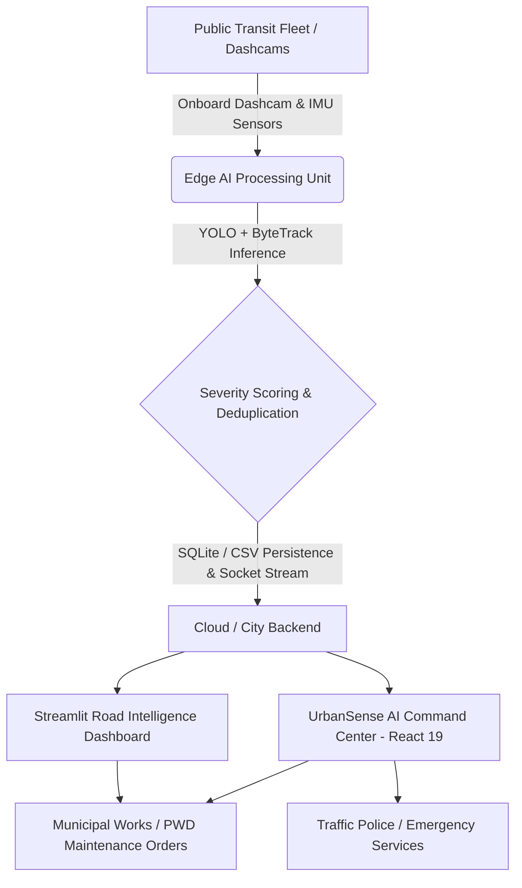

# 🛰️ UrbanSense AI — Mobile Urban Intelligence Platform

> **Transforming public transit fleets into intelligent, real-time sensing grids for smart city governance.**  
> *Developed for Smart India Hackathon (SIH 2026).*

---

## 📌 Overview

**UrbanSense AI** converts municipal transit buses and public service vehicles into mobile edge-sensing nodes. By leveraging lightweight computer vision models and edge compute on transit vehicles, UrbanSense continuously maps road quality, detects defects, monitors traffic congestion, and detects safety incidents across city roads—without requiring expensive static camera infrastructure on every street.

---

## ✨ Key Features

- 🛣️ **Automated Road Intelligence**: Real-time detection and geospatial clustering of potholes, cracks, waterlogging, and road damage.
- 🎯 **ByteTrack Defect Persistence**: Object tracking prevents duplicate counting of the same pothole/crack across consecutive video frames.
- 📐 **Severity Indexing & Road Condition Score (0–100)**: Quantitative scoring of pavement deterioration based on defect geometry, surface density, and Pavement Condition Index (PCI) standards.
- 📈 **Time-Series Deterioration Monitoring**: Multi-pass historical degradation tracking to catch expanding micro-cracks before structural base failure.
- 🔧 **Predictive Maintenance Planning**: Algorithmic generation of municipal work orders, prioritizing asphalt patching vs. resurfacing with material tonnage estimates.
- 🚦 **Dynamic Traffic Analytics**: Congestion heatmaps, corridor density tracking, and speed profiling across transit routes.
- 🚨 **Real-Time Incident Management**: Automated alerts for vehicle breakdowns, traffic obstruction, and safety anomalies with live video feeds.
- ⚡ **Edge AI & Low-Bandwidth Telemetry**: Local inference using YOLO, TensorFlow.js, and OpenCV with deduplication to minimize 4G/5G data overhead.
- 🚌 **Live Fleet Tracking**: Real-time GPS positioning, route telemetry, and sensor health diagnostics for all active buses.
- 📊 **Dual Command Centers**: High-performance React 19 web command center + dedicated Streamlit inspection and time-series analytics dashboard.

---

## 🔄 Road Condition Monitoring Workflow

```mermaid
graph LR
    A[Road Video / Dashcam] -->|Video Ingestion| B(YOLO Object Detection)
    B -->|Potholes, Cracks, Damaged Pavement| C(ByteTrack Object Tracking)
    C -->|Persistent Defect ID & Trajectory| D(Severity Estimation)
    D -->|Area Ratio, Depth Variance| E(Road Condition Score 0-100)
    E -->|SQLite / CSV Flatfile Storage| F(Historical & Time-Series Analysis)
    F -->|Decay Rate & Priority Queue| G[Predictive Maintenance Planning]
```



> **The Paradigm Shift**: Traditional systems stop at identifying isolated potholes. UrbanSense AI transforms road inspection from reactive alert-triggering into continuous lifecycle road-condition scoring, severity quantification, deterioration forecasting, and automated municipal work-order planning.

---

## 🏗️ System Architecture



---

## 🛠️ Tech Stack

- **Computer Vision & AI**: Ultralytics YOLO11 (State-of-the-art vision architecture with C3k2 & C2PSA attention), ByteTrack Multi-Object Tracker, OpenCV, TensorFlow.js
- **Severity & Scoring**: Pavement Condition Index (PCI 0–100), Laplacian depth variance, bounding-box area ratios
- **Data & Storage**: SQLite (`road_damage.db`), CSV exports, Pandas, Time-series analysis
- **Frontend Command Center**: React 19, Vite, Leaflet / React-Leaflet, Chart.js, Lucide Icons
- **Analytics Dashboard**: Streamlit, Plotly Express & Graph Objects, PyDeck GIS mapping
- **Backend / Real-time**: Node.js, Express, Socket.io, Python Edge Pipelines

---

## 🚀 Getting Started

### Prerequisites
- Node.js (v18+)
- npm or yarn
- Python 3.10+ (for edge pipeline and Streamlit dashboard)

### 1. React Command Center Setup

```bash
# Install frontend dependencies
npm install

# Start the Vite development server
npm run dev
# Open http://localhost:5173
```

### 2. Road Condition Engine & Streamlit Dashboard Setup

```bash
# Navigate to edge directory
cd edge

# Install Python requirements
pip install -r requirements.txt

# Run the end-to-end Road Condition Analysis Engine (Video → YOLO → ByteTrack → Severity → SQLite/CSV)
python road_analysis_engine.py

# Launch the Streamlit Analytics & Inspection Dashboard
streamlit run streamlit_app.py
# Open http://localhost:8501
```

---

## 👥 Authors & Acknowledgments

- **Team UrbanSense** — Smart India Hackathon (SIH 2026)

