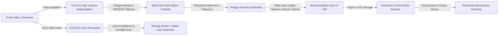
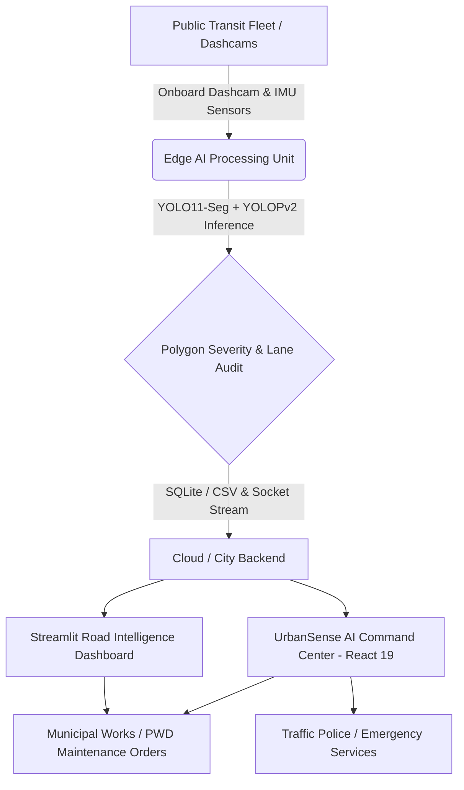

# 🛰️ UrbanSense AI — Mobile Urban Intelligence Platform (v2.0)

> **Transforming public transit fleets into intelligent, real-time sensing grids for smart city governance.**  
> *Developed for Smart India Hackathon (SIH 2026).*

---

## 📌 Overview

**UrbanSense AI** converts municipal transit buses and public service vehicles into mobile edge-sensing nodes. By leveraging lightweight computer vision models and edge compute on transit vehicles, UrbanSense continuously maps road quality, detects defects, monitors traffic congestion, and detects safety incidents across city roads—without requiring expensive static camera infrastructure on every street.

### v2.0 Upgrade: Instance Segmentation + Lane Perception

This version introduces a **three-tier AI vision architecture**:
1. **YOLO11-Seg** (Instance Segmentation) — Replaces bounding boxes with exact polygon mask contours for precise defect area measurement and repair volume estimation.
2. **YOLOPv2** (Panoptic Driving Perception) — Simultaneous lane line detection and drivable area segmentation for identifying missing dividers and faded lane markings.
3. **RDD2022** (Road Damage Dataset) — International defect classification standard: D00 (Longitudinal Crack), D10 (Transverse Crack), D20 (Alligator Crack), D40 (Pothole/Crater).

---

## ✨ Key Features

- 🛣️ **Instance Segmentation Road Intelligence**: Exact polygon mask detection of potholes, cracks, and road damage using YOLO11-Seg — not just bounding boxes.
- 📐 **Repair Volume Estimation**: Pixel-to-meter calibration converts segmentation masks into real-world repair surface area (m²) and asphalt volume (m³).
- 🏷️ **RDD2022 International Classification**: Defects categorized by global road damage codes (D00, D10, D20, D40) for IRC/PWD compliance.
- 🛤️ **Lane & Divider Auditing**: YOLOPv2 panoptic perception detects missing road dividers, faded lane markings, and absent zebra crossings.
- 🎯 **ByteTrack Defect Persistence**: Multi-object tracking prevents duplicate counting across consecutive video frames.
- 📐 **Severity Indexing & Road Condition Score (0–100)**: Quantitative scoring based on polygon mask area, surface texture, and Pavement Condition Index (PCI) standards.
- 📈 **Time-Series Deterioration Monitoring**: Multi-pass historical degradation tracking to catch expanding micro-cracks before structural base failure.
- 🔧 **Predictive Maintenance Planning**: Algorithmic work-order generation with segmentation-based asphalt tonnage estimates (density × volume).
- 🚦 **Dynamic Traffic Analytics**: Congestion heatmaps, corridor density tracking, and speed profiling across transit routes.
- 🚨 **Real-Time Incident Management**: Automated alerts for vehicle breakdowns, traffic obstruction, and safety anomalies.
- ⚡ **Edge AI & Low-Bandwidth Telemetry**: Dual-rate pipeline — YOLO11-Seg at 25 FPS + YOLOPv2 at 3 FPS on edge hardware.
- 🚌 **Live Fleet Tracking**: Real-time GPS positioning, route telemetry, and sensor health diagnostics.
- 📊 **Dual Command Centers**: React 19 web command center + Streamlit inspection/analytics dashboard.

---

## 🔄 Road Condition Monitoring Workflow (v2.0)



> **The Paradigm Shift**: UrbanSense AI v2.0 moves beyond bounding-box detection into **instance segmentation** — measuring exact defect polygons for precise repair volume estimation, combined with **panoptic lane perception** for complete roadway infrastructure auditing.

---

## 🏗️ System Architecture



---

## 🛠️ Tech Stack

- **Computer Vision & AI**:
  - **YOLO11-Seg** (Ultralytics) — Instance segmentation with C3k2 & C2PSA attention, polygon mask output
  - **YOLOPv2** — Panoptic driving perception (drivable area + lane line segmentation)
  - **ByteTrack** — Multi-object tracker for defect persistence
  - **OpenCV** — Frame processing, CLAHE enhancement, polygon rendering
- **Defect Classification**: RDD2022 International Standard (D00, D10, D20, D40)
- **Severity & Scoring**: Pavement Condition Index (PCI 0–100), polygon mask area, Laplacian depth variance, repair volume (m³)
- **Data & Storage**: SQLite (`road_damage.db`), CSV exports, Pandas, Time-series analysis
- **Frontend Command Center**: React 19, Vite, Leaflet / React-Leaflet, Chart.js, Lucide Icons
- **Analytics Dashboard**: Streamlit, Plotly Express & Graph Objects, PyDeck GIS mapping
- **Backend / Real-time**: Node.js, Express, Socket.io, Python Edge Pipelines

---

## 🚀 Getting Started

### Prerequisites
- Node.js (v18+)
- npm or yarn
- Python 3.10+ (for edge pipeline and Streamlit dashboard)

### 1. React Command Center Setup

```bash
# Install frontend dependencies
npm install

# Start the Vite development server
npm run dev
# Open http://localhost:5173
```

### 2. Road Condition Engine & Streamlit Dashboard Setup

```bash
# Navigate to edge directory
cd edge

# Install Python requirements (includes ultralytics for YOLO11-Seg, onnxruntime for YOLOPv2)
pip install -r requirements.txt

# Run the end-to-end Road Condition Analysis Engine
# (Video → YOLO11-Seg → ByteTrack → Polygon Severity → YOLOPv2 Lane Audit → SQLite/CSV)
python road_analysis_engine.py

# Launch the Streamlit Analytics & Inspection Dashboard
streamlit run streamlit_app.py
# Open http://localhost:8501
```

---

## 🏷️ RDD2022 Defect Classes

| Code | Defect Type | Description | Severity Weight |
|------|------------|-------------|----------------|
| **D00** | Longitudinal Crack | Wheel track cracks parallel to road direction | 0.90× |
| **D10** | Transverse Crack | Perpendicular expansion/contraction cracks | 1.05× |
| **D20** | Alligator Crack | Network fatigue cracking (structural failure) | 1.20× |
| **D40** | Pothole / Crater | Open cavities with material loss | 1.30× |

---

## 👥 Authors & Acknowledgments

- **Team UrbanSense** — Smart India Hackathon (SIH 2026)
