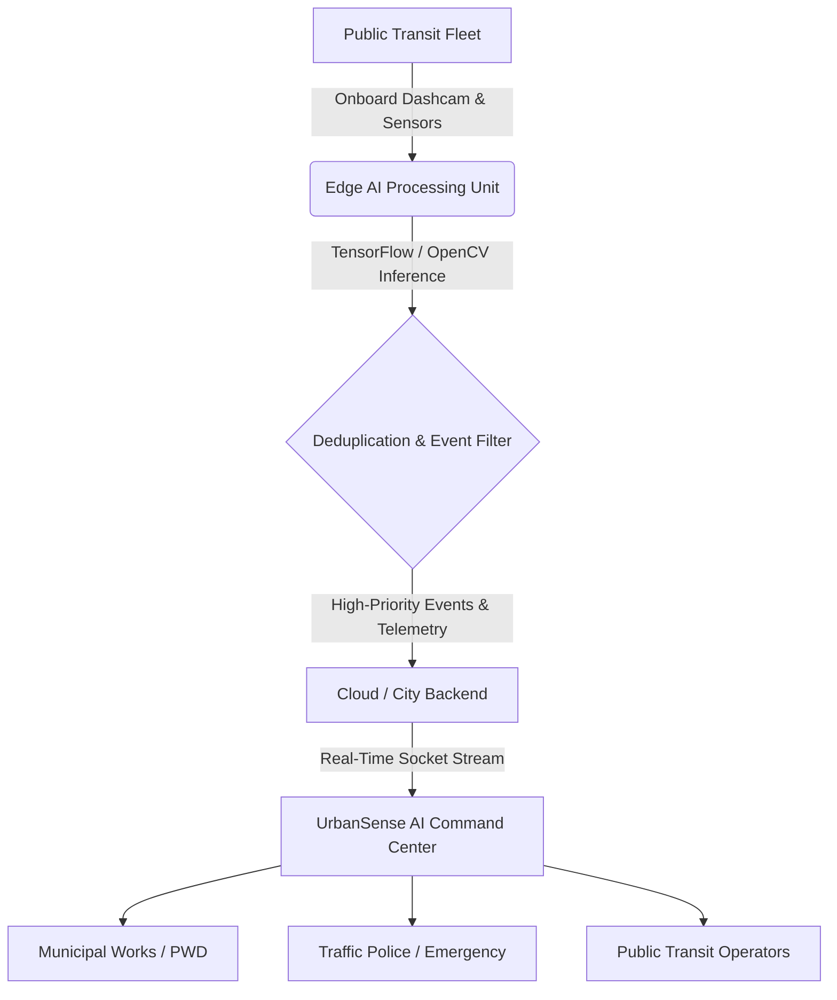

# 🛰️ UrbanSense AI — Mobile Urban Intelligence Platform

> **Transforming public transit fleets into intelligent, real-time sensing grids for smart city governance.**  
> *Developed for Smart India Hackathon (SIH 2026).*

---

## 📌 Overview

**UrbanSense AI** converts municipal transit buses and public service vehicles into mobile edge-sensing nodes. By leveraging lightweight computer vision models and edge compute on transit vehicles, UrbanSense continuously maps road quality, detects defects, monitors traffic congestion, and detects safety incidents across city roads—without requiring expensive static camera infrastructure on every street.

---

## ✨ Key Features

- 🛣️ **Automated Road Intelligence**: Real-time detection and geospatial clustering of potholes, cracks, waterlogging, and road debris.
- 🚦 **Dynamic Traffic Analytics**: Congestion heatmaps, corridor density tracking, and speed profiling across transit routes.
- 🚨 **Real-Time Incident Management**: Automated alerts for vehicle breakdowns, traffic obstruction, and safety anomalies with live video feeds.
- ⚡ **Edge AI & Low-Bandwidth Telemetry**: Local inference using TensorFlow.js / Python edge pipelines with deduplication to minimize 4G/5G data overhead.
- 🚌 **Live Fleet Tracking**: Real-time GPS positioning, route telemetry, and sensor health diagnostics for all active buses.
- 🗺️ **Interactive Command Center**: High-performance Leaflet mapping, density heatmaps, and customizable analytical dashboards.

---

## 🏗️ System Architecture



---

## 🛠️ Tech Stack

- **Frontend**: React 19, Vite, React Router, Lucide Icons, Chart.js, Leaflet / React-Leaflet, Leaflet Heat
- **AI & Vision**: TensorFlow.js, COCO-SSD, OpenCV Edge Pipeline (Python)
- **Backend / Real-time**: Node.js, Express, Socket.io
- **Styling**: Modern dark-theme design system with glassmorphism & responsive layouts

---

## 🚀 Getting Started

### Prerequisites
- Node.js (v18+)
- npm or yarn
- Python 3.10+ (for edge pipeline simulation)

### Installation

1. **Clone the repository:**
   ```bash
   git clone https://github.com/prathameshmowade/urbansense-ai.git
   cd urbansense-ai
   ```

2. **Install frontend dependencies:**
   ```bash
   npm install
   ```

3. **Start the development server:**
   ```bash
   npm run dev
   ```
   Open your browser at `http://localhost:5173`.

4. **(Optional) Run Edge Python Pipeline:**
   ```bash
   cd edge
   pip install -r requirements.txt
   python edge_pipeline.py
   ```

---

## 👥 Authors & Acknowledgments

- **Team UrbanSense** — Smart India Hackathon (SIH 2026)

